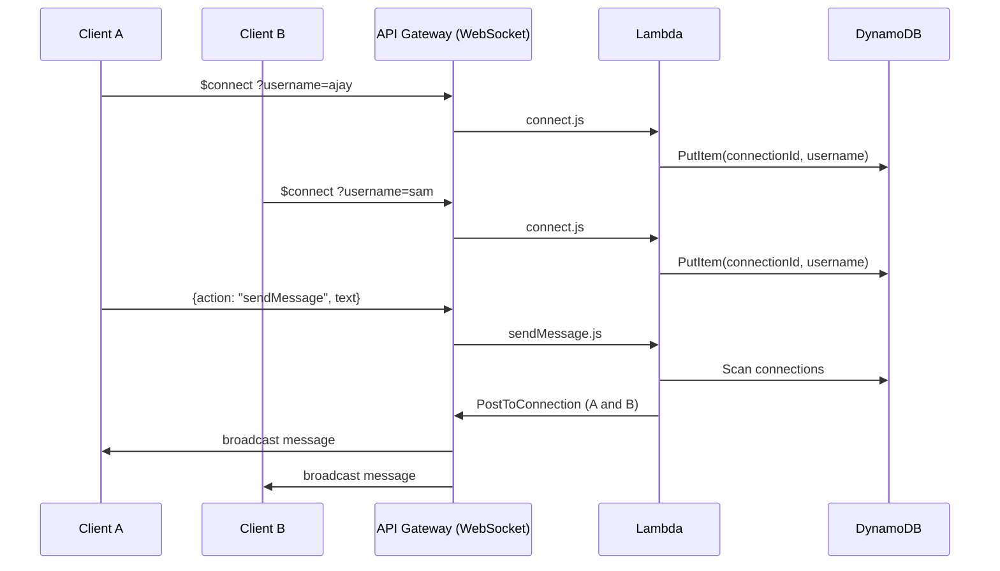

# Realtime Presence & Chat

A serverless real-time chat/presence backend built on AWS API Gateway WebSocket API, Lambda, and DynamoDB, defined entirely as infrastructure-as-code with AWS CDK. No servers to manage, scales to zero, and demonstrates the fan-out broadcast pattern used in production systems for notifications, live dashboards, and collaborative apps.

## Architecture



Four Lambda functions handle the WebSocket lifecycle:

- **`connect.js`** — runs on `$connect`, stores `connectionId` + `username` in DynamoDB
- **`disconnect.js`** — runs on `$disconnect`, removes that row
- **`sendMessage.js`** — runs on the custom `sendMessage` route, scans all open connections and pushes the message to each one via the API Gateway Management API, pruning any connection that comes back `410 Gone` (stale/closed without a clean disconnect)
- **`default.js`** — catch-all for any message whose `action` doesn't match a known route

## Project structure

```
realtime-presence-chat/
├── cdk/
│   ├── bin/app.js                     # CDK app entry point
│   └── lib/realtime-dashboard-stack.js # Infrastructure definition
├── lambda/
│   ├── connect.js
│   ├── disconnect.js
│   ├── sendMessage.js
│   └── default.js
├── client/
│   └── index.html                     # Browser test client
├── cdk.json
├── package.json
└── README.md
```

## Prerequisites

- Node.js 18+
- An AWS account with the CLI configured (`aws configure`)
- AWS CDK CLI: `npm install -g aws-cdk`

## Setup

```bash
npm install

# one-time per AWS account/region
cdk bootstrap aws://<ACCOUNT_ID>/<REGION>
```

## Deploy

```bash
cdk deploy
```

CDK prints a `WebSocketURL` output when it finishes, e.g.:

```
RealtimeDashboardStack.WebSocketURL = wss://abc123.execute-api.ap-south-1.amazonaws.com/prod
```

## Try it out

**Quick check with wscat:**

```bash
npm install -g wscat
wscat -c "wss://<your-url>/prod?username=ajay"
```

Once connected, send: `{"action": "sendMessage", "text": "hello"}`

**Full test with the browser client:**

1. Open `client/index.html` in two browser tabs
2. Paste the `WebSocketURL` into each, give each tab a different username, click Connect
3. Send a message from one tab — it should appear in both, proving the broadcast fan-out works

**Inspect the data:** AWS Console → DynamoDB → Tables → your `ConnectionsTable` → _Explore table items_. Rows only exist while a connection is open — expect 0 items when nothing's connected, which confirms cleanup is working, not broken.

## Cleaning up

Everything here is pay-per-use, so idle cost is near zero, but tear it down when you're done demoing:

```bash
cdk destroy
```

## Why this project is a good portfolio piece

It goes beyond a typical CRUD tutorial: it requires reasoning about connection state in a stateless compute model (Lambda has no memory between invocations, so DynamoDB stands in for the "who's connected" state a long-running server would normally hold in memory), handling partial failure during a broadcast (one dead connection shouldn't break delivery to everyone else), and expressing the whole thing as versioned, reviewable infrastructure code instead of console clicks.

## Extending it (good follow-up commits)

- Broadcast a live "N users online" count alongside chat messages
- Add chat rooms/channels (partition connections by a `room` attribute)
- Persist message history to a second DynamoDB table
- Swap the plain-HTML client for a small React app
- Add Cognito auth so `username` isn't self-reported
- Add a GitHub Actions workflow that runs `cdk diff` on PRs and `cdk deploy` on merge to main
