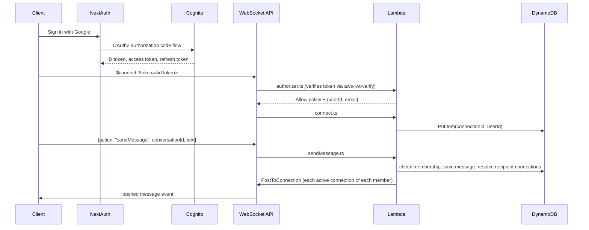

# Realtime Presence & Chat

A serverless, real-time messaging platform built on AWS (API Gateway WebSocket API, Lambda, DynamoDB, Cognito) with a WhatsApp/Telegram-style Next.js frontend. Infrastructure is defined entirely as code with AWS CDK — no servers to manage, scales to zero, and demonstrates production patterns for connection state, auth, and fan-out messaging in a stateless compute model.

## Architecture

**Auth:** Users sign in with Google via Cognito Hosted UI (OAuth2/OIDC authorization code flow). NextAuth (frontend) holds the resulting ID/access/refresh tokens and refreshes them automatically before they expire. Every WebSocket connection carries the current Cognito ID token as a query-string parameter; a Lambda `REQUEST` authorizer verifies it on `$connect` and rejects the handshake if it's invalid or expired. Once connected, every Lambda already knows `userId`/`email` from the authorizer context — no per-message auth is needed.

**Messaging model:** All chats — 1:1 and group — live in one unified `Conversations` + `ConversationMembers` pair of tables, instead of separate DM/group schemas. 1:1 conversations get a deterministic ID (`dm#<sortedUserIds>`) so starting a DM is idempotent; groups get a generated `group#<uuid>`. `ConversationMembers` is the membership mapping table (also queryable by `userId` via a GSI), and it's what `sendMessage` uses to resolve "who should receive this" regardless of chat type.



Lambda functions (TypeScript, bundled individually via CDK's `NodejsFunction`, Node.js 20.x runtime):

- **`authorizer.ts`** — `REQUEST`-type WebSocket authorizer on `$connect`; verifies the Cognito ID token (`aws-jwt-verify`) and returns an `Allow` policy plus `{userId, email}` context consumed by every other Lambda
- **`connect.ts`** — runs on `$connect`, stores `connectionId` + `userId` in `ConnectionsTable`, upserts the user in `UsersTable`
- **`disconnect.ts`** — runs on `$disconnect`, removes that connection row
- **`sendMessage.ts`** — accepts only `{conversationId, text}`; verifies the sender is a member of that conversation, persists the message to `MessagesTable`, resolves every member's active connections (via `ConversationMembers` → `Connections` byUserId GSI) and pushes the message to each one, pruning any connection that comes back `410 Gone`
- **`startConversation.ts`** — creates (or finds, idempotently) a 1:1 DM conversation between the caller and a given user, pushes a `conversationStarted` event back to the caller
- **`listConversations.ts`** — resolves and pushes back the caller's full conversation list (with display names) — called once on WebSocket connect open
- **`getMessages.ts`** — checks membership, pushes back the full message history for a conversation, on demand when the user opens it
- **`createConversation.ts`** — creates a group conversation, pushes a `groupCreated` event back
- **`default.ts`** — catch-all for any message whose `action` doesn't match a known route

**Important gotcha baked into every route above:** API Gateway WebSocket routes have no built-in request/response cycle. A Lambda's return value (`{statusCode, body}`) is only visible in CloudWatch/API Gateway logs — it is never delivered to the client. Every route that needs to tell the frontend something explicitly calls `PostToConnectionCommand` back to the caller's own `connectionId`.

## Project structure

Monorepo: `backend/` (AWS CDK + Lambda, npm) and `frontend/` (Next.js app, pnpm).

```
realtime-presence-chat/
├── backend/
│   ├── cdk/
│   │   ├── bin/app.ts                          # CDK app entry — loads env, wires AuthStack → RealtimeDashboardStack
│   │   └── lib/
│   │       ├── auth-stack.ts                   # Cognito UserPool + Google IdP + Hosted UI domain + UserPoolClient
│   │       └── realtime-dashboard-stack.ts      # Tables, Lambdas, WebSocket API, routes, grants
│   ├── lambda/
│   │   ├── authorizer.ts
│   │   ├── connect.ts
│   │   ├── disconnect.ts
│   │   ├── default.ts
│   │   ├── sendMessage.ts
│   │   ├── startConversation.ts
│   │   ├── listConversations.ts
│   │   ├── getMessages.ts
│   │   └── createConversation.ts
│   ├── client/
│   │   └── index.html                          # Plain-HTML WebSocket test client (pre-auth, mostly superseded by frontend/)
│   ├── cdk.json
│   ├── tsconfig.json
│   └── package.json
├── frontend/
│   ├── src/
│   │   ├── app/
│   │   │   ├── api/auth/[...nextauth]/route.ts # NextAuth route handler
│   │   │   ├── layout.tsx
│   │   │   ├── providers.tsx                   # SessionProvider wrapper
│   │   │   └── page.tsx                        # Thin orchestrator: auth gate + selectedConversationId state
│   │   ├── components/
│   │   │   ├── Header.tsx                      # Auth/session + WebSocket connection status
│   │   │   ├── ConversationList.tsx             # Left sidebar: conversations, start DM, create group
│   │   │   └── ChatWindow.tsx                   # Right pane: message history + composer for selected conversation
│   │   ├── hooks/
│   │   │   └── useChatSocket.ts                 # Owns the WebSocket connection, conversations, messages-by-conversation
│   │   ├── lib/
│   │   │   └── auth.ts                          # NextAuth config: CognitoProvider, token refresh, session shape
│   │   └── types/
│   │       └── next-auth.d.ts                   # Module augmentation for session.idToken / session.user.id / session.error
│   ├── next.config.ts
│   └── package.json
├── README.md
├── AGENTS.md
└── CLAUDE.md
```

## Prerequisites

- Node.js 18+ and pnpm (for `frontend/`)
- An AWS account with the CLI configured (`aws configure`)
- AWS CDK CLI: `npm install -g aws-cdk`
- A Google OAuth 2.0 client (Client ID + Secret) from Google Cloud Console, with `https://<your-cognito-domain>/oauth2/idpresponse` as an authorized redirect URI

## Setup

**Backend:**

```bash
cd backend
npm install

# one-time per AWS account/region
cdk bootstrap aws://<ACCOUNT_ID>/<REGION>
```

Create a `.env` in `backend/cdk/` (or wherever `bin/app.ts` loads it from) with your Google OAuth credentials:

```
GOOGLE_CLIENT_ID=...
GOOGLE_CLIENT_SECRET=...
```

**Frontend:**

```bash
cd frontend
pnpm install
```

Create `frontend/.env.local`:

```
COGNITO_CLIENT_ID=...
COGNITO_CLIENT_SECRET=...
COGNITO_ISSUER=https://cognito-idp.<region>.amazonaws.com/<userPoolId>
COGNITO_DOMAIN=https://<your-cognito-domain>.auth.<region>.amazoncognito.com
NEXTAUTH_SECRET=...
NEXTAUTH_URL=http://localhost:3000
NEXT_PUBLIC_WEBSOCKET_URL=wss://<your-api-id>.execute-api.<region>.amazonaws.com/prod
```

(Values for `COGNITO_*` and the WebSocket URL come from the CDK outputs below.)

## Deploy

```bash
cd backend
cdk deploy --all
```

This deploys `AuthStack` first (Cognito), then `RealtimeDashboardStack` (tables, Lambdas, WebSocket API), which takes `AuthStack`'s User Pool ID/Client ID as props. CDK prints outputs including:

```
AuthStack.UserPoolId = ap-south-1_xxxxxxxxx
AuthStack.UserPoolClientId = xxxxxxxxxxxxxxxxxxxxxxxxxx
AuthStack.UserPoolDomainUrl = https://realtime-chat-ajay.auth.ap-south-1.amazoncognito.com
RealtimeDashboardStack.WebSocketURL = wss://abc123.execute-api.ap-south-1.amazonaws.com/prod
```

Feed these into `frontend/.env.local`, then run the frontend:

```bash
cd frontend
pnpm dev
```

## Try it out

1. Open `http://localhost:3000`, click "Sign in with Google" — this goes through Cognito Hosted UI → Google → back to the app with a session.
2. Open a second browser (or incognito window) and sign in as a different Google account.
3. In either window, start a DM or create a group from the sidebar; send messages back and forth — they should appear on both sides in real time.
4. **Inspect the data:** AWS Console → DynamoDB → `ConversationsTable` / `ConversationMembersTable` / `MessagesTable` / `ConnectionsTable` → Explore table items. `ConnectionsTable` rows only exist while a connection is open.

**Quick low-level check with wscat** (bypasses the frontend, useful for debugging the WebSocket layer directly — you need a valid Cognito ID token, e.g. copied from the browser session):

```bash
npm install -g wscat
wscat -c "wss://<your-url>/prod?token=<idToken>"
```

Once connected: `{"action": "listConversations"}`.

## Cleaning up

Everything here is pay-per-use, so idle cost is near zero, but tear it down when you're done demoing:

```bash
cd backend
cdk destroy --all
```

## Why this project is a good portfolio piece

It goes well beyond a CRUD tutorial: real federated auth (Cognito + Google, OAuth2/OIDC, token refresh) protecting a WebSocket handshake via a custom Lambda authorizer; a data model designed to unify two conceptually different chat types (1:1 and group) behind one schema instead of duplicating logic; reasoning about connection state and fan-out delivery in a stateless compute model where nothing survives between Lambda invocations; and a real production gotcha (WebSocket routes have no automatic response — you must explicitly push data back) discovered and fixed during the build, not glossed over. The whole stack — infra, backend, and frontend — is expressed as versioned, reviewable code.

## Roadmap

This project is growing from a WebSocket demo into a full messaging platform, built serverless first and later planned for a rebuild on self-managed microservices infrastructure for comparison. Current/planned phases:

1. ~~Migrate backend to TypeScript~~ — done
2. ~~Authentication (Cognito + Google) + Next.js frontend scaffold~~ — done
3. ~~Persistent 1:1 chat (message history, unified conversations model)~~ — done
4. ~~Group chat + WhatsApp-style UI (sidebar conversation list + chat pane)~~ — done
5. File sharing (images, PDFs, audio, video via S3)
6. Notifications (push + delivered/read receipts)
7. Stretch: message search, load testing, rate limiting
8. Rebuild the same feature set on self-managed microservices infrastructure, for comparison
